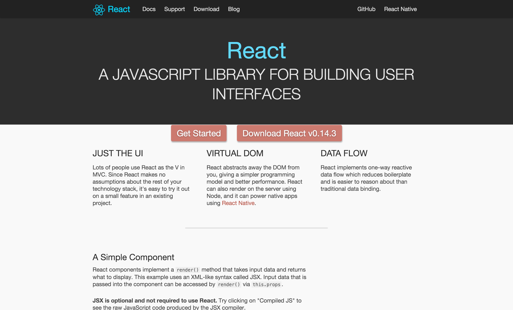
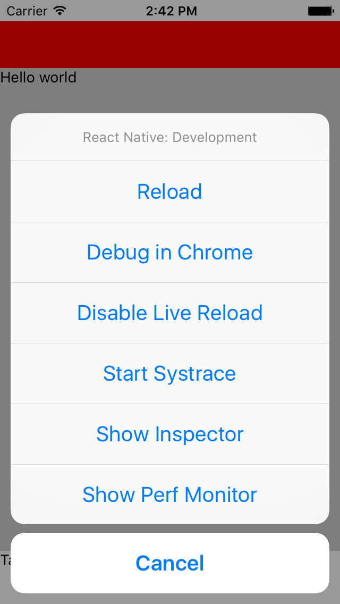

# [fit] How to develop a
# [fit] react-native app

# [fit] Cologne.js meetup, 9th december 2015, Christoph Jerolimov

---

<!--
## Agenda

* What is React.js and React Native?
* EcmaScript 2015 / Flexbox
* ~~Animationen~~
* ~~Flow~~
* ~~Navigator~~

^Was ist das und warum brauch ich das?
^Crossplatform wtf / Cordova

---
-->

<!--
## Agenda
### Für iOS/Android Entwickler:

* Was ist react? Was ist dadran native?

^Warum? Crossplatform? Cordova?

^ npm, babel, server

* JavaScript?!
* Layouten mit "sowas wie HTML & CSS"

^ JSX, Stylesheets, Flexbox

* Integrationsmöglichkeiten

---
-->

## About myself
### Christoph Jerolimov

Developer with passion, current focus on mobile.

Co-Founder bringnow and mobile.cologne meetup

Follow me [@jerolimov](https://twitter.com/jerolimov)

Contact me [christoph@jerolimov.de](mailto:christoph@jerolimov.de)

---

## Benefits
### React.js

* Declarative view-only library for the web
  (one-way data flow simplifies data-binding)
* Define how the app should look based on a dataset
* React handles how the UI updates when the data changes
* Component model which makes encapsulated, reuseable and testable modules

---

## Benefits
### React-native

* Same as React.js!
* Write JS, renders native views (no WebView!)
* Share code and knowhow
* Better developer experience (DX)
* (Easy) Integration options in both directions

---



---


---


---

## React.js (*spring 2013)

GitHub rank #8, ~32.500 stars, 570+ contributors

> HTML is just the beginning.

[^1]: [https://facebook.github.io/react/blog/2013/06/05/why-react.html](https://facebook.github.io/react/blog/2013/06/05/why-react.html)

---

## React.js (*spring 2013)

GitHub rank #8, ~32.500 stars, 570+ contributors

> HTML is just the beginning.

## react-native (*spring 2015)

GitHub rank #27, ~23.500 stars, 420+ contributors

angular #3, jquery #7, docker #18, atom #30

[^2]: [https://facebook.github.io/react/blog/2013/06/05/why-react.html](https://facebook.github.io/react/blog/2013/06/05/why-react.html)

[^3]: [https://facebook.github.io/react/blog/2015/03/26/introducing-react-native.html](https://facebook.github.io/react/blog/2015/03/26/introducing-react-native.html)

---

## [fit] Write once, run anywhere
## [fit] Initially Java, but html5 too

---

# [fit] ~~Write once, run anywhere~~
# [fit] **Learn** once, use anywhere

^Learn just one pattern, one language, different APIs

^User expected different behaviour on different platforms

^Facebook Ads Team developed the Android version within three months and with 85 % code sharing.

---

## History
### react-native

Announced 01/2015
v0.1 @ 03/2015 First public release
v0.5 @ 06/2015 Accessibility API
v0.6 @ 06/2015 View Inspector, Performance tools
v0.8 @ 07/2015 New Animation API
v0.11 @ 09/2015 **Android support**
v0.13 @ 10/2015 Linux and Windows support
v0.15 @ 11/2015 iOS requires Xcode 7+, Geolocation & Intents on Android

---

## Roadmap
### react-native

* Implement missing views like Maps, Webview and others on Android.
* Android M permissions
* Improve the performance
* API improvements like a unified `<ViewPager>` `<AndroidViewPager>` and `<ScrollView pagingEnabled={true}>`
* ...

---

## Developer Experience
### The webstuff we love

* Modern HTML- & CSS-like => JSX + Flexbox
* Modern JavaScript w/ optional Flow (or TypeScript)
* Hot reloading (⌘R) & Live Reload
* Debugger, UI Inspector, Profiling

^Decrease turn around times, write it, test it, try again.

---



---

<!--
## How does it work?
### Performance

* Native UI, Fast, Responsive
* Smooth animations
* Complex gestures
* Everything runs asynchronous
* Bridge is batched
* Never as fast as optimized native code

---
-->

## How does it work?
### Development

* You write javascript in your favorited editor
* App communicates with a local http server

Server starten:

```
npm start
```

---

## How does it work?
### Production

* Precompiled, minified JS bundled within the app
* Code updates are technical possible.. and allowed

Bundlen:

```
react-native bundle --entry-file index --platform ios --bundle-output main.jsbundle
```

---

## How does it work?
### Technical

* Based on a minimal JS VM: JavaScriptCore
  which is part of WebKit
* Android bundles the library w/ the app (3,5 MB)
* iOS 7 includes a shared version already
* JS <-> Native bridge is replaceable
  Use a inter process model by default and can also run the app in a remote process, for example in the Chrome (for Debugging)

---

## How does it work?
### Supported platforms

* Android 4.1+, >= 93 % [^1]
* iOS 7+, >= 96 % [^2] [^3]

^Also common native targets

[^1]: [https://developer.android.com/about/dashboards/index.html](https://developer.android.com/about/dashboards/index.html)

[^2]: [https://david-smith.org/iosversionstats/](https://david-smith.org/iosversionstats/)

[^3]: [https://developer.apple.com/support/app-store/](https://developer.apple.com/support/app-store/)

<!--
---

## Pro and cons
### For me

+ + Native development (better UX than WebViews)
+ + Improved DX (Live Reloading!!!!)
+ + Cross Platform (learn once, use anywhere)
+ + Code sharing between Android, iOS, maybe web?
+ + Solid ecosystem (node, npm, babel, redux, ...)
- - Some native components are 2nd-class components

^I personally missed the initial statement that it's "not just a crossplattform technique" and that it wrappes native components.

^For example the NavigatorIOS (NavigationController) is not actively maintained.
-->

---

## Pro and cons
### For a JS developer

+ + Native development (better UX than WebViews)
+ + Same ecosystem (npm, babel, React.js, ...)
+ + Code sharing (with web / backend)?!
- - More complex builds with "native problems"
- - Maybe less stable than Cordova
- - No media queries (but Flexbox and code switches)

^for example signing issues

---

## Pro and cons
### For a native developer

+ + Improved DX (Live Reloading!)
+ + Cross Platform (learn once, use anywhere)
+ + Code sharing between Android and iOS
+ + Integration into / of other native components
- - Another programming language and maybe paradigma
- - Missing tool support (auto completion, etc.)
- - Maybe API limitation (but you can DIY)

---

## Pro and cons
### For the product owner

+ + Knowhow sharing means more flexiblity
+ + Code sharing
+ + Native development (better UX than WebViews)
+ + Solid ecosystem (node, npm, babel, redux, ...)
- - Future-proofness?

^IMO, this are the same arguments if you 'order' an app, develop your own app or develop a customer app:

^Developed by Facebook means that it is controlled, with all the pros and cons. But nobody knows if it will reach a 1.0 and will be supported also in two years. The JS land moves very fast.

---

## Getting Started[^4]
### General software requirements

* OSX is the most common dev platform (at FB)
  and also required for iOS
* Linux and Windows should work[^5]
* You need [Node.js](https://nodejs.org/) 4+, [nvm](https://github.com/creationix/nvm#installation) is recommended

```bash
brew install watchman
npm install --global react-native
```

[^4]: [http://facebook.github.io/react-native/docs/getting-started.html](http://facebook.github.io/react-native/docs/getting-started.html)

[^5]: [http://facebook.github.io/react-native/docs/linux-windows-support.html](http://facebook.github.io/react-native/docs/linux-windows-support.html)

---

## Getting Started
### Platform dependencies

* Android SDK[^6]
* Xcode 7+ for iOS

[^6]: [http://facebook.github.io/react-native/docs/android-setup.html](http://facebook.github.io/react-native/docs/android-setup.html)

---

## Getting Started
### Project setup

```
npm install -g react-native-cli

react-native init MyFirstApp

# IMHO missing by default:
cd MyFirstApp
npm install --save-dev react-native-cli
```

---

## Getting Started
### Android

Start an Android emulator or connect your device.

```bash
adb devices # should list at least one device

adb reverse tcp:8081 tcp:8081
react-native run-android
```

---

## Getting Started
### iOS

Open the Xcode project from the ios folder and start the app via Project > Run.

```bash
open ios/*.xcodeproj
npm start
# run the app within Xcode
```

---

## [fit] Demo

---

## [fit] JavaScript
### [fit] EcmaScript 2015/2016
### [fit] ~~Optional: TypeScript~~

---

## EcmaScript 2015
### Spread Operator

```javascript
// var firstname = person.firstname;
// var lastname = person.lastname;
const { firstname, lastname } = person;

const person2 = {
	firstname // :firstname
	lastname // :lastname
}

// Object.assign({}, person2, { firstname: 'New name' })
const person3 = {
	...person2,
	firstname: 'New name'
}

```

---

## EcmaScript 2015
### Classes

```javascript
class MyButton extends Button {
	constructor(props) {
		super(props)
	}
	
	compontentDidMount() {
		super.compontentDidMount();
		this.mounted = true;
	}
}
```

---

## EcmaScript 2015
### Closures

```javascript
// var x = function() { ... }
const min = (a, b) => (a < b ? a : b);
const max = (a, b) => {
	return a > b ? a : b;
};
```

---

## EcmaScript 2015

### Import / Export

```javascript
import React from 'react'; // var React = require('react');

class MyButton extends React.Component {
}

export default MyButton;

// Short:
import React, { Component, View, Text } from 'react';

export default class MyButton extends Component {
}
```

---

## [fit] React + JSX

---

## React.js
### JSX example

```javascript
class HelloWorld {
	render() {
		return <span>Hello World</span>;
	}
}
```

---

## React.js
### JSX transformation

```javascript
class HelloWorld {
	render() {
		return <Text>Hello World</Text>;
	}
}
```

Will be transformed with babel to:

```javascript
class HelloWorld {
	render() {
		return React.createElement(Text, null, 'Hello World');
	}
}
```

---

## React.js
### Local state

```javascript
class HelloWorld {
	constructor() {
		this.state = { say: 'Hello' };
	}

	render() {
		const goodbye = () => {
			this.setState({ say: 'Goodbye' });
		}
		
		return (
			<span onclick={ goodbye }>
				{ this.state.say } World!
			</span>
		);
	}
}
```

---

## React.js
### External props

```javascript
class HelloWorld {
	render() {
		return (
			<span onclick={ goodbye }>
				{ this.state.say } { this.props.user }
			</span>;
		);
	}
}

class MyApp {
	render() {
		return <html><body><HelloWorld name="World" /></body></html>;
	}
}
```

---

## React-native
### UI Components

* View
* Text
* Image
* TouchableOpacity
* ...
* ScrollView
* ListView

---

## React-native
### JSX hello world

```javascript
class HelloWorld {
	render() {
		return <Text>Hello World</Text>;
	}
}

AppRegistry.registerComponent('MyApp', () => HelloWorld);
```

---

## react-native
### A simple view hierachy

```javascript
	<View>
		<Text>Hello World</Text>
		<Text>Hello World</Text>
	</View>
```

Flexbox is enabled for any view!

Vertical layout is the default.

---

## react-native
### Changed Flexbox direction

```javascript
	<View style={{ flexDirection: 'row' }}>
		<Text>Hello World</Text>
		<Text>Hello World</Text>
	</View>
```

---

## react-native
### Stylesheets, CSS-like

```javascript
	const bold = {
		fontWeight: 'bold' // A string!
	};

	const styles = StyleSheet.create({
		bold: {
			fontWeight: 'bold'
		}
	});

	<View style={{ borderWidth: 1, borderColor: 'red' }}>
		<Text style={ bold }>Hello World</Text>
		<Text style={ styles.bold }>Hello World</Text>
	</View>
```

---

## react-native
### Flexbox

```javascript
	// Grow 100% with childs 50%, 30% and 20%
	<View style={{ flex: 1, flexDirection: 'row' }}>
		<View style={{ flex: 0.5, backgroundColor: 'red' }} />
		<View style={{ flex: 0.3, backgroundColor: 'blue' }} />
		<View style={{            backgroundColor: 'green' }} />
	</View>;

	// Grow 100% where first and last child is fix
	<View style={{ flex: 1 }}>
		<View style={{ height: 64, backgroundColor: 'red' }} />
		<View style={{             backgroundColor: 'blue' }} />
		<View style={{ height: 50, backgroundColor: 'green' }} />
	</View>;
```

---

## [fit] Demo

---

<!--
## [fit] How can I structure my app

---


---
-->

## Structure your app
### Manage the state

* Flux and the single source of truth (state)
* Split your code into
  * "dump presentation" components and
  * "smarter containers"
* Persist the state (incl. the navigation stack) makes Auto Reloading finally awesome

```bash
npm install --save redux react-redux@3.1 redux-persist
```

---

## Structure your app
### View stack

* Navigator vs NavigatorIOS, both supports loops,...
* Recommended: Serializable routes (to persist them)
* Then render views based on a plain json route:

```javascript
navigator.push({ identifier: 'UserDetail', userId: 1234 });

renderScene(route, navigator) {
	if (route.identifier === 'UserDetail') {
		return <UserDetail userId={ route.userId };
	} else {
		return <ViewNotFound />;
	}
}
```

---

<!--
## Structure your app
### Navigator

```javascript
<Navigator
		ref='navigator'
		initialRouteStack={ navigationStack }
		navigationBar={
				<Navigator.NavigationBar
						navigationStyles={Navigator.NavigationBar.StylesIOS}
						routeMapper={ this.routeMapper() }
						style={ styles.navigationBar }
				/>
		}
		renderScene={ this.renderScene.bind(this) }
		configureScene={ this.configureScene.bind(this) }
		onDidFocus={ this.saveNavigationStack.bind(this) }
		sceneStyle={{ paddingTop: 64 }}
/>
```

---

## NavigationStack
### Render routes

```javascript
renderScene(route, navigator) {
	if (route.routeIdentifier === 'UserDetail') {
		return <UserDetail userId={ route.userId };
	} else {
		return <ViewNotFound />;
	}
}

configureScene(route, navigator) {
	const defaultSceneConfig = Navigator.SceneConfigs.PushFromRight;
	if (route && typeof route.sceneConfig === 'string') {
		return Navigator.SceneConfigs[route.sceneConfig] || defaultSceneConfig;
	} else {
		return defaultSceneConfig;
	}
}
```

---

## NavigationStack
### Push, pop and persist

```javascript
pushRandomView() {
	const randomRoute = routes[parseInt(Math.random() * routes.length)];
	this.refs.navigator.push(routes);
}

popView() {
	this.refs.navigator.pop()
}

saveNavigationStack() {
	const currentRouteStack = this.refs.navigator.getCurrentRoutes();	
	// ...
}
```

---
-->

## Structure your app
### Platform specific code

Auto-select component based on a file suffix:

```
Slider.android.js
Slider.ios.js
```

Or a good old platform switch:

```js
import { Platform } from 'react-native';

if (Platform.OS === 'android') {
    // ...
} else {
    // ...
}
  
```

---

### Links

. [facebook.github.io/react-native](http://facebook.github.io/react-native/) (incl. API docs)
. [facebook.github.io/react/blog/](http://facebook.github.io/react/blog/) (for both libs)
. [github.com/facebook/react-native/releases](https://github.com/facebook/react-native/releases)
. [www.reactnative.com](http://www.reactnative.com/) (not the offi. blog)
. [github.com/rackt](https://github.com/rackt) (redux, react-redux, ..)
. [github.com/jondot/awesome-react-native](https://github.com/jondot/awesome-react-native)
. [react.parts](https://react.parts/native)
. [speakerdeck.com/frantic/under-the-hood](https://speakerdeck.com/frantic/react-native-under-the-hood) 1
. [speakerdeck.com/mkonicek/under-the-hood](https://speakerdeck.com/mkonicek/under-the-hood-of-react-native) 2

---

## [fit] Thank you. Any Questions?
