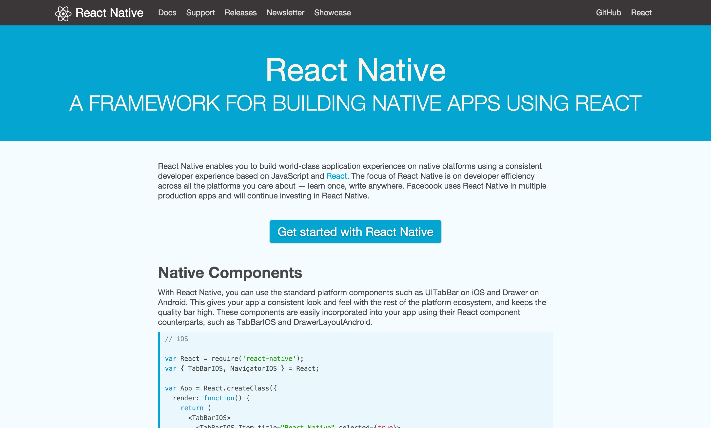
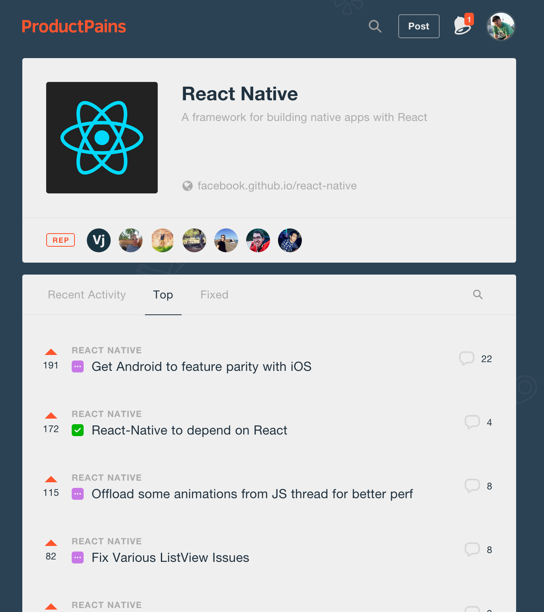

# [fit] Introduction
# [fit] **react-native**

## [fit] PottJS Meetup, May 4th 2016, Christoph Jerolimov

---


## **Agenda**

* Motivation & Concept
* Components / Native Components
* Stylesheets / Flexbox
* Demo

---


## [fit] **Write once**, run anywhere
## [fit] Initially Java, but html5 too

---


# [fit] ~~Write once, run anywhere~~
# [fit] **Learn once**, use anywhere

^Learn just one pattern, one language, different APIs
User expected different behaviour on different platforms
Facebook Ads Team developed the Android version within three months and with 85 % code sharing.

---



^Announced Jan 2015, first version published spring 2015
Sep 2015 Android support
GitHub rank #27, ~23.500 stars, 420+ contributors

---


## **Why?**

* Reuse react.js (web) to render the view hierarchy
* Renders native views (no WebView!)
* Polyfills for networking (fetch), Geolocation, ...
* (Easy) Integration options in *both* directions

---


## **Why react?**

**Declerative UI**
(Unidirectional data flow)

**A view-only library**
(the view in MVC, but MVC is not required)

**Automatically updates the view hierarchy**

^Components are capsulated, reuseable, testable units
Simple to understand and maintain

---


## **Developer Experience?**

* "HTML- & CSS-like" => JSX + Flexbox
* Hot reloading (⌘R) & Live Reload
* Debugger, UI Inspector, Profiling

^Modern JavaScript w/ optional Flow (or TypeScript)
^Decrease turn around times, write it, test it, try again.

---


---


## **In development**

* You write **"modern" javascript** in your favorited editor
* Babel transform the sources (ES6 and more...)
* App communicates with a local http server

---


## **In production**

* Precompiled, minified JS bundled within the app
* Code updates are technical possible.. and allowed

---


## **Technical**

* Based on a **minimal JS VM: JavaScriptCore**
* JS controls the native UI
* JS renders the "virtual DOM" as JSON
* JS <-> Native bridge (multithreaded)
* Native part renders UI based on this JSON

^JSX is part of WebKit
iOS 7 includes a shared version already
Android bundles the library w/ the app (3,5 MB)

^Use a inter process model by default and can also run the app in a remote process, for example in the Chrome (for Debugging)


---


## **Supported platforms**

* Android 4.1+, >= 93 % [^1]
* iOS 7+, >= 96 % [^2] [^3]

^Also common native targets

[^1]: [https://developer.android.com/about/dashboards/index.html](https://developer.android.com/about/dashboards/index.html)

[^2]: [https://david-smith.org/iosversionstats/](https://david-smith.org/iosversionstats/)

[^3]: [https://developer.apple.com/support/app-store/](https://developer.apple.com/support/app-store/)

---


## **Getting Started**[^4]

* Requires [Node.js](https://nodejs.org/) 4+, [nvm](https://github.com/creationix/nvm#installation) is recommended
* OSX is the common dev platform (at FB)
* Linux and Windows should work[^5]
* Android SDK[^6] for Android / Xcode 7+ for iOS

[^4]: [http://facebook.github.io/react-native/docs/getting-started.html](http://facebook.github.io/react-native/docs/getting-started.html)

[^5]: [http://facebook.github.io/react-native/docs/linux-windows-support.html](http://facebook.github.io/react-native/docs/linux-windows-support.html)

[^6]: [http://facebook.github.io/react-native/docs/android-setup.html](http://facebook.github.io/react-native/docs/android-setup.html)

---


#[fit] **Hello world**

---


## **JS + JSX**

```javascript
class HelloWorld extends Component {
	render() {
		return <Text>Hello World</Text>;
	}
}

AppRegistry.registerComponent('MyApp', () => HelloWorld);
```

---


## **Stylesheets**

```javascript
	const bold = {
		fontWeight: 'bold' // A string!
	};

	const styles = StyleSheet.create({
		bold: {
			fontWeight: 'bold'
		}
	});

	<View style={{ borderWidth: 1, borderColor: 'red' }}>
		<Text style={ bold }>Hello World</Text>
		<Text style={ styles.bold }>Hello World</Text>
	</View>
```

---


## **Flexbox**

```javascript
	// Grow 100% with childs 50%, 30% and 20%
	<View style={{ flex: 1, flexDirection: 'row' }}>
		<View style={{ flex: 0.5, backgroundColor: 'red' }} />
		<View style={{ flex: 0.3, backgroundColor: 'blue' }} />
		<View style={{            backgroundColor: 'green' }} />
	</View>;

	// Grow 100% where first and last child is fix
	<View style={{ flex: 1 }}>
		<View style={{ height: 64, backgroundColor: 'red' }} />
		<View style={{             backgroundColor: 'blue' }} />
		<View style={{ height: 50, backgroundColor: 'green' }} />
	</View>;
```

---


## **View components**

**View, Text, TextInput, Image, Switch, ScrollView,** PickerIOS, ProgressBarAndroid, ProgressViewIOS, **WebView, ListView, Navigator,** NavigatorIOS, Modal, **MapView,** RefreshControl, TabBarIOS, ActivityIndicatorIOS, DatePickerIOS, **DrawerLayoutAndroid,** PullToRefreshViewAndroid, SegmentedControlIOS, SliderIOS, TouchableHighlight, **TouchableOpacity,** TouchableWithoutFeedback, **...**

---


## **Other APIs / modules**

ActionSheetIOS, **Alert,** AlertIOS, **Animated,** AppRegistry, AppState, AppStateIOS, AsyncStorage, **BackAndroid,** CameraRoll, Dimensions, IntentAndroid, InteractionManager, LayoutAnimation, LinkingIOS, **NetInfo, PanResponder, PushNotificationIOS, StatusBarIOS,** **StyleSheet, ToastAndroid, VibrationIOS**, **...**

---


---


## [fit] **Demo**

---


## **Production ready?**

---



---


## **Status & Roadmap**

* 0.x - But production ready if your brave.
* Some components are not yet available on Android  
  (MapView for example, but community projects are available for all common problems!)
* Android M permissions
* Performance and API improvements

---


## **Navigation**

pain: Navigator / NavigatorIOS / DrawerLayoutAndroid

better: [ExNavigator](https://github.com/exponentjs/ex-navigator) by James @Ide

upcoming: [NavigationExperimental](https://github.com/facebook/react-native/tree/master/Libraries/NavigationExperimental)

tip: Make your navigation stack serializable

---


## **Performance**

* Native UI, e.g. ScrollView
* Smooth animations
* Sometimes laggy, e.g. ListView,  
  missing estimated cell height?
* Never as fast as *optimized* native code

---


## **Platform switch**

Auto-select component based on a file suffix:

```
CustomShoppingCardItem.android.js
CustomShoppingCardItem.ios.js
```

Or a good old platform switch:

```js
import { Platform } from 'react-native';

if (Platform.OS === 'android') {
    // ...
} else {
    // ...
}

```

---


## [fit] **Questions?**

---


## [fit] Questions?
## [fit] **Thank you!**
