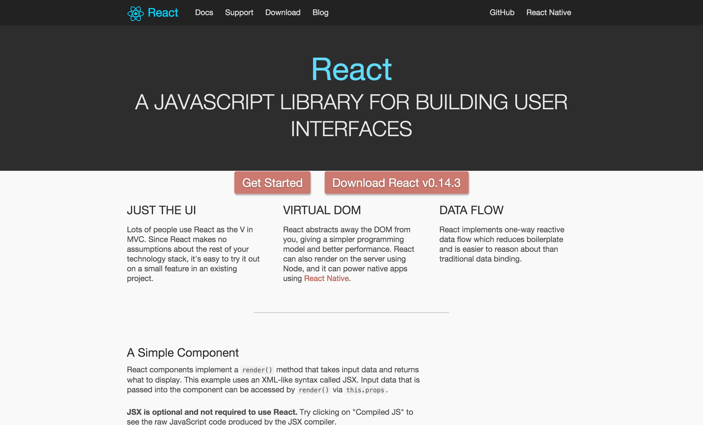
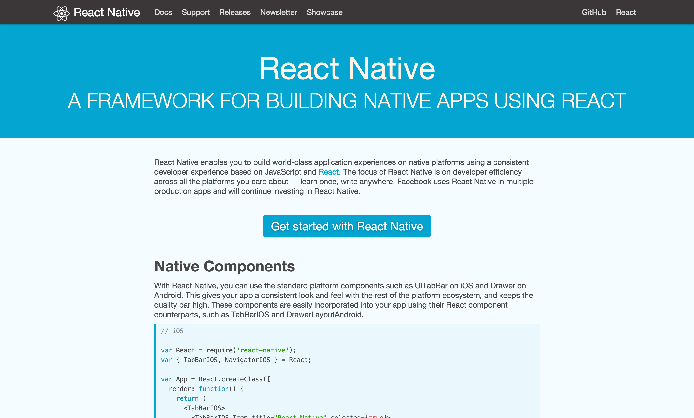
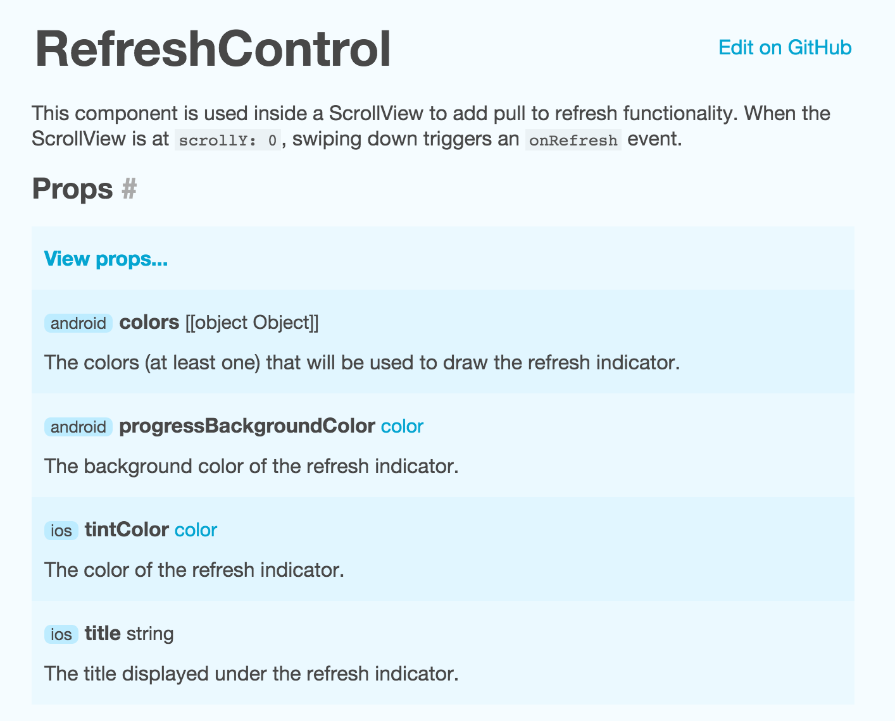

# [fit] Introduction
# [fit] **react-native**

## [fit] WWRuhr Meetup, Essen, June 23th 2016, Christoph Jerolimov

---


## **Agenda**

* <React />
* <ReactNative />
* Motivation & Concept
* Native Components / Stylesheets / Flexbox

---



^What's react.js, a lib, no framework
Easy to integrate, also on small parts
Pushished mid 2013 by Facebook
Mitte 2013 von Facebook veröffentlicht
First reactions were rather skeptical.
JSX is JS superset

---


## **React**

**Declerative UI**
In general, a uni-directional data flow.

**A view-only library**
The view in MVC, but MVC is not required.

**Automatically updates the DOM, when necessary**
The browser is just *one possible* rendering engine.

^Components are capsulated, reuseable, testable units
Simple to understand and maintain

---


## **React-native**

**Declerative UI**
In general, a uni-directional data flow.

**A view and bridging library**
View, geolocation, network, ...

**Automatically updates the view hierarchy, when necessary**
The browser is just *one possible* rendering engine.

^Components are capsulated, reuseable, testable units
Simple to understand and maintain

---



^Announced Jan 2015, first version published spring 2015
Sep 2015 Android support
GitHub rank #27, ~23.500 stars, 420+ contributors

---


## **React JSX example**

JSX is a JS superset and supports sub-components (and DOM elements) inline:

```javascript
import React, { Component } from 'react';

class HelloWorld extends Component {
	render() {
		return <span>Hello World</span>;
	}
}

// Usage: <HelloWorld />
```

---


## **React-native JSX example**

JSX is a JS superset and supports sub-components inline:

```javascript
import React, { Component } from 'react';
import { Text } from 'react-native';

class HelloWorld extends Component {
	render() {
		return <Text>Hello World</Text>;
	}
}

// Usage: <HelloWorld />
```

---


## **JSX property example**

Usage of external properties, not only strings:

```javascript
import React, { Component } from 'react';
import { Text } from 'react-native';

class Hello extends Component {
	render() {
		return <Text>Hello {{ this.props.person.firstname }}</Text>;
	}
}

// Usage: <Hello person={   { firstname: 'Max', ... }   } />
```

---


## **JSX state example**

```js
class Blink extends Component {
	componentWillMount() {
		setInterval(() => {
			this.setState({ visible: !this.state.visible });
		}, 1000);
	}

	render() {
		const style = { opacity: this.state.visible ? 1 : 0 };
		return <Text style={ style }>{ this.props.children }</Text>
	}
}

// Usage: <Blink>  <Hello person={{ firstname: 'Max' }} />  </Blink>
```

---

## **Components**


Every Element is/extends a react `Component`

External immutable **props**<br/>vs<br/>Internal private **state**

Must implement at least the `render()`-method

Optional methods to handle the lifecycle/updates
(componentWillMount ... componentWillUnmount)

(There are other ways to define a component...)

---

## **Virtual DOM**


DOM manipulations are slow.

Render method generates a VDOM ("JSON")<br/>and calculates a diff to reduce DOM manipulations.
<br/>

*render ( UI-State<sub>n</sub> ) => VDOM<sub>n</sub>*
<br/>

*diff ( VDOM<sub>n-1</sub> , VDOM<sub>n</sub> ) => DOM updates...*

^The virtual DOM is a JS object, not bindet directly to the DOM.
This allow performance hacks etc.

---


## **Reasons for react-native**

* Reuse react.js knowhow (build feature not tech teams)
* Increase **native dev** developer experience
* Easy **integration in both** directions
  * Integrate react-native view into native VH.
  * Integrate native view into react-native VH.
* Better UX than a WebView

---


## **Developer Experience**

* "HTML- & CSS-like" => JSX + Flexbox
* Hot reloading (⌘R) & Live Reload
* Debugger, UI Inspector, Profiling

^Modern JavaScript w/ optional Flow (or TypeScript)
^Decrease turn around times, write it, test it, try again.

---


## **How does it work?**

* Based on a **minimal JS VM: JavaScriptCore** (EcmaScript 5)
  * Android 4.1+, >= 96 % [^1]
  * iOS 7+, >= 97 % [^2] [^3]
* **JS <-> Native bridge** (multithreaded)
  * JS renders the "virtual DOM" -> JSON
  * Native part renders the native UI <- JSON

^JSX is part of WebKit
iOS 7 includes a shared version already
Android bundles the library w/ the app (3,5 MB)

^Use a inter process model by default and can also run the app in a remote process, for example in the Chrome (for Debugging)

^Also common native targets

[^1]: [https://developer.android.com/about/dashboards/index.html](https://developer.android.com/about/dashboards/index.html)

[^2]: [https://david-smith.org/iosversionstats/](https://david-smith.org/iosversionstats/)

[^3]: [https://developer.apple.com/support/app-store/](https://developer.apple.com/support/app-store/)

---


## **Getting Started**[^1]

* Requires [Node.js](https://nodejs.org/) 4+, [nvm](https://github.com/creationix/nvm#installation) is recommended
  * for Android development: Android SDK[^2]
  * for iOS development: Xcode 7+ (read as: a Mac)
* OSX is the common dev platform (at FB)
* but Linux and Windows should work[^3]

[^1]: [http://facebook.github.io/react-native/docs/getting-started.html](http://facebook.github.io/react-native/docs/getting-started.html)

[^2]: [http://facebook.github.io/react-native/docs/linux-windows-support.html](http://facebook.github.io/react-native/docs/linux-windows-support.html)

[^3]: [http://facebook.github.io/react-native/docs/android-setup.html](http://facebook.github.io/react-native/docs/android-setup.html)

---


## **In development**

* You write **"modern" javascript** in your favorited editor
* Babel transform the sources (ES6 and more...)
* App communicates with a local http server

---


## **In production**

* Precompiled, minified JS bundled within the app
* Code updates are technical possible.. and allowed

---


## [fit] **Demo**

---


## **View components**

**View, Text, TextInput, Image, Switch, ScrollView,** PickerIOS, ProgressBarAndroid, ProgressViewIOS, **WebView, ListView, Navigator,** NavigatorIOS, Modal, **MapView,** RefreshControl, TabBarIOS, ActivityIndicatorIOS, DatePickerIOS, **DrawerLayoutAndroid,** PullToRefreshViewAndroid, SegmentedControlIOS, SliderIOS, TouchableHighlight, **TouchableOpacity,** TouchableWithoutFeedback, ...

---


## **Other APIs / modules**

ActionSheetIOS, **Alert,** AlertIOS, **Animated,** AppRegistry, AppState, AppStateIOS, AsyncStorage, **BackAndroid,** CameraRoll, Dimensions, IntentAndroid, InteractionManager, LayoutAnimation, LinkingIOS, **NetInfo, PanResponder, PushNotificationIOS, StatusBarIOS,** **StyleSheet, ToastAndroid, VibrationIOS**, ...

---



---


## **Stylesheets**

```javascript
	const bold = {
		fontWeight: 'bold' // A string!
	};

	const styles = StyleSheet.create({
		bold: {
			fontWeight: 'bold'
		}
	});

	<View style={{ borderWidth: 1, borderColor: 'red' }}>
		<Text style={ bold }>Hello World</Text>
		<Text style={ styles.bold }>Hello World</Text>
	</View>
```

---


## **Flexbox**

```javascript
	// Grow 100% with childs 50%, 30% and 20%
	<View style={{ flex: 1, flexDirection: 'row' }}>
		<View style={{ flex: 0.5, backgroundColor: 'red' }} />
		<View style={{ flex: 0.3, backgroundColor: 'blue' }} />
		<View style={{            backgroundColor: 'green' }} />
	</View>;

	// Grow 100% where first and last child is fix
	<View style={{ flex: 1 }}>
		<View style={{ height: 64, backgroundColor: 'red' }} />
		<View style={{             backgroundColor: 'blue' }} />
		<View style={{ height: 50, backgroundColor: 'green' }} />
	</View>;
```

---


## **Navigation**

pain: Navigator / NavigatorIOS / DrawerLayoutAndroid

better: [ExNavigator](https://github.com/exponentjs/ex-navigator) by James @Ide

upcoming: [NavigationExperimental](https://github.com/facebook/react-native/tree/master/Libraries/NavigationExperimental)

tip: Make your navigation stack serializable

---


## **Performance**

* Native UI, e.g. ScrollView
* Smooth animations
* ListView has no estimated cell yet

---


## **Platform switch**

Auto-select component based on a file suffix:

```
CustomShoppingCardItem.android.js
CustomShoppingCardItem.ios.js
```

Or a good old platform switch:

```js
import { Platform } from 'react-native';

if (Platform.OS === 'android') {
    // ...
} else {
    // ...
}

```

---


## **Status & Roadmap**

* 0.x - But production ready if your brave.
* Some components are not yet available on Android  
  (MapView for example, but community projects are available for all common problems)
* Android M permissions
* Performance and API improvements

---


## [fit] **Questions?**

---


## [fit] Questions?
## [fit] **Thank you!**
